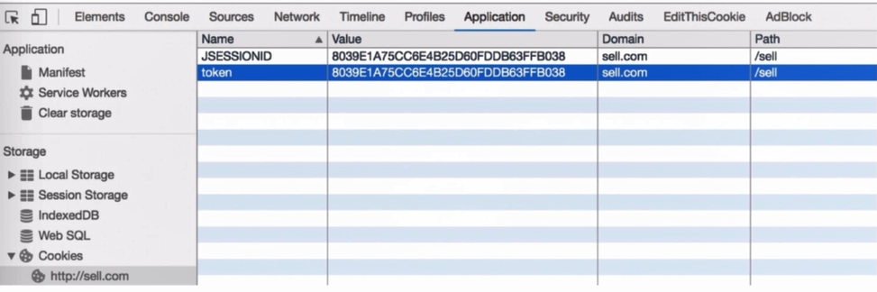

# Spring boot微信订餐实战
## 项目整体概况


## 数据库设计
- 数据库版本升级（必须使用**5.7**版本的MySQL,否则default current_timestamp不能生效）
phpstudy 集成环境升级 MySQL 版本
来自 <https://laravel-china.org/articles/4281/phpstudy-integrated-environment-upgrade-mysql-version> 

- 涉及计算的字段（单价） 用decimal(8,2)类型，八位，两位小数

Utf8mb4 --  表情可以保存在数据库

- logback配置
    - 区分info和error
    - 每天产生一个日志文件


## 填坑
- IntelliJ IDEA下"Cannot resolve symbol 'log'"的解决方法
IntelliJ IDEA，导入后可以编译运行。但是输出日志的log.xxxx();语句中的‘log’都显示为红色，鼠标放上去后显示:Cannot resolve symbol 'log'。
首先检查了pom文件中跟日志相关的依赖，没发现什么问题。同时，项目运行时是可以输出日志的，只是红色的标记让人太纠结了。
想起之前使用Eclipse时是要专门配置lombok的，于是在网上搜i关键字dea和lombok，发现idea提供了lombok的插件，不妨一试。安装也简单：

1.用快捷键Ctrl+Alt+S打开：Settings→Plugins→Browse repositories

2.输入lom后选择Install，安装插件

3.按照提示重启IDEA即可

- 引入Lombok Plugin
file - settings - plugin - browse repository - lombok
遇到无法链接 time out的问题：
    - 设置代理
    
    
- could not initialize proxy - no Session
https://blog.csdn.net/zhangjq520/article/details/53740971

这是由于我们使用懒加载加载数据的方法，当我们要获取的数据的时候，但是session已经关闭了，我们支持在Spring MVC中需要配置一个OpenEntityManagerInViewFilter 过滤器，Spring针对Hibernate的非JPA实现用的是OpenSessionInViewFilter，那么在Spring Boot中怎么支持呢？

特别特别的简单，只需要在application.properties中加入如下配置：

spring.jpa.open-in-view=true

- 大小写快捷切换
ctrl + shift + u

- Could not autowire. No beans of 'xxxx' type found
可能引入的类忘记添加@Service注解

- synchronized为了防止多线程时产生相同的随机数     
```
// synchronized为了防止多线程时产生相同的随机数
public static synchronized String genUniqueKey() {
  Random random = new Random();
  Integer number = random.nextInt(900000) + 100000; // 六位随机数

  return System.currentTimeMillis() + String.valueOf(number);
}
```

- 多线程条件下，防止“超卖”。【重点问题】
多线程的情况下，两个订单同时扣库存可能造成扣小于零的情况，后面使用radis锁进行处理

- 越权访问的问题，订单findOne 【重点问题】


- 一个模块开发的步骤
    - DAO层
    - Service层
    - Controller层
    
    
- 一个好的习惯：先用注释将要开发的功能列出来
- double类型的数据比较，不能直接equals比较，应该相减小于某个精度进行判断

### 微信网页授权
- [官方文档](https://mp.weixin.qq.com/wiki?t=resource/res_main&id=mp1445241432)
- [调试](https://natapp.cn/)
- [第三方sdk](https://github.com/Wechat-Group/weixin-java-tools)

- 坑啊  个人账号无法使用支付功能

- 难点：【手工获取openid】:（**第一步需要设置一个外网地址，本地可以访问的**）
    - 申请一个测试号
    - 设置域名（微信白名单校验）：使用工具natapp，买一个账号，要下载软件，启动转发（将外网地址指到127.0.0.1:8080等等），校验文件放到网站根目录
    - 获取code：有一个scope参数，base（用户无感知、获取信息较少）、userInfo（点击之后有弹窗，用户确认登录）
    - 换取access_token
    
- 自动获取：用到第三方sdk（主要涉及几个回调和重定向）


### 微信支付
- [文档](https://pay.weixin.qq.com/wiki)
- [SDK](https://github.com/Pay-Group/best-pay-sdk)

- 【重要】【支付流程】由于没有企业号，无法调用支付的接口，所以这里没有去做，但这里应该去做的具体流程是
    - 授权（获取openId，支付中会用到）（可以用到测试号进行测试）
    - 支付
    - 授权 + 支付
    
- 调试工具：
    - fidler:将手机的网络请求转到电脑上抓包
    - natapp 用于微信白名单校验，需要使用到外网域名
    
    
### 卖家端页面
- freemarker(spring-boot-starter-freemarker)

- 如果想要更新模板不想重建项目，每次修改完成后：选择`build-> build project`，项目不需要整体重建就可在网页更新，
    - 然后可以修改快捷键为 ctrl + s 
    - 只适用于更改模板文件
    
### 分布式系统
- 多节点 - 分布式系统
- 消息通信 - 集群
- 不共享内存 - 分布式计算：分布式计算是共享内存的（hadoop）两个厨子炒一样的菜，最后放在一个盘子里，分不清哪个是谁炒的

不共享主内存但通过网络消息合作，各个节点通过消息来通信：前端通过restful api访问后端接口

- 注意：分布式计算是共享内存的（hadoop）两个厨子炒一样的菜，最后放在一个盘子里，分不清哪个是谁炒的

两个后厨：
- 一个洗菜一个炒菜：分布式：卖家端+买家端
- 两个都炒菜：集群：卖家端部署在多台服务器上同样的代码（卖家端集群）

- 分布式和集群的区别和联系
    - 分布式指不同业务功能的节点，集群指相同功能的节点
    - 分布式系统中每个节点都可以做集群（买家端、卖家端可以部署一个或n个成为集群）
    - 集群的规模由节点的业务规模来决定
    - 集群未必是分布式的，前后端未分离的一个系统，很多功能写在一起，就算用很多机器做了集群，但节点之间并不需要进行消息通信，所以它并不是分布式的

- session
    - 会话控制，http连接无状态，需要一个机制记录信息（key-value机制）
    
- key-value机制(全局唯一，一个用户一个标识)
    - sessionId(在cookie里设置)
    - token（可能配合签名保证安全）
    
    
- 分布式集群两种方式
    - 水平扩展：A1 A2两台机器完全相同的内容
    - 垂直扩展：业务拆分 - A1 A2 A3分别负责商品、订单、类目不同的功能
    
- 一种解决分布式系统下session的方案：ip-hash，相同的用户都访问同一台服务器，这种方式弊端：在一台服务器压力过大挂掉以后，这台服务器的用户就都不能用了
- 通用的解决方案：用一个专门的服务保存用户session，不同的服务需要session的时候都去找他要


### 登录登出功能
- 文档:微信开放平台---https://open.weixin.qq.com -- 资源中心 -- 网站应用 -- 微信登录功能
- 这尼玛开放平台的登录功能也必须是企业账号


### redis
- 工具：redis desktop manager
- 命令行连接（需要安装）：redis-cli -h 192.168.30.113

- 使用redis：
1. 引入依赖
```xml
 <!--使用redis-->
<dependency>
    <groupId>org.springframework.boot</groupId>
    <artifactId>spring-boot-starter-data-redis</artifactId>
</dependency>
```
2. 配置
```
spring:
  redis:
    host: 192.168.30.113
    port: 6379
    password
```
3. Autowired引入项目 + 使用
```
@Autowired
private StringRedisTemplate redisTemplate;
```
```
redisTempalte.opsForValue().set("","")
```