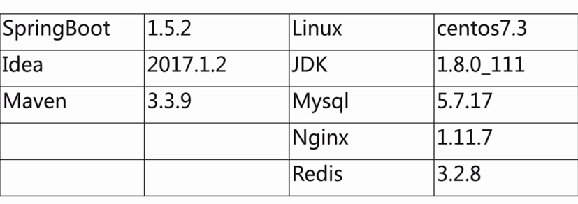
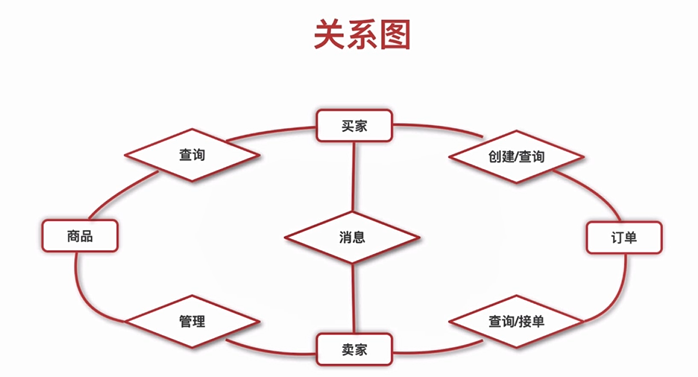
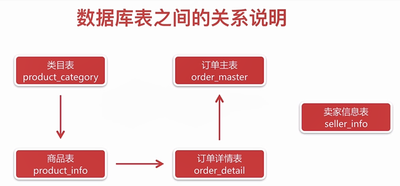
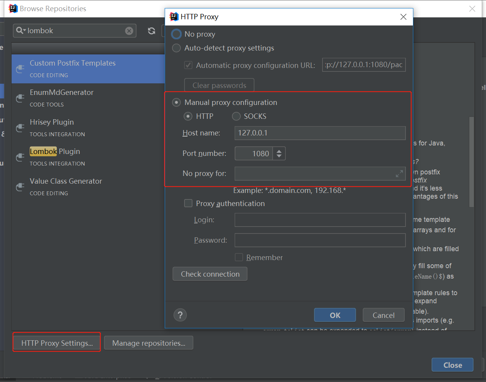

# Spring boot微信订餐实战
## 项目整体概况

## 数据库设计
- 数据库版本升级（必须使用5.7版本的MySQL,否则default current_timestamp不能生效）
phpstudy 集成环境升级 MySQL 版本
来自 <https://laravel-china.org/articles/4281/phpstudy-integrated-environment-upgrade-mysql-version> 

- 涉及计算的字段（单价） 用decimal(8,2)类型，八位，两位小数

Utf8mb4 --  表情可以保存在数据库

- logback配置
    - 区分info和error
    - 每天产生一个日志文件

## 填坑
- IntelliJ IDEA下"Cannot resolve symbol 'log'"的解决方法
IntelliJ IDEA，导入后可以编译运行。但是输出日志的log.xxxx();语句中的‘log’都显示为红色，鼠标放上去后显示:Cannot resolve symbol 'log'。
首先检查了pom文件中跟日志相关的依赖，没发现什么问题。同时，项目运行时是可以输出日志的，只是红色的标记让人太纠结了。
想起之前使用Eclipse时是要专门配置lombok的，于是在网上搜i关键字dea和lombok，发现idea提供了lombok的插件，不妨一试。安装也简单：

1.用快捷键Ctrl+Alt+S打开：Settings→Plugins→Browse repositories

2.输入lom后选择Install，安装插件

3.按照提示重启IDEA即可

- 引入Lombok Plugin
file - settings - plugin - browse repository - lombok
遇到无法链接 time out的问题：
    - 设置代理
    
    
- could not initialize proxy - no Session
https://blog.csdn.net/zhangjq520/article/details/53740971

这是由于我们使用懒加载加载数据的方法，当我们要获取的数据的时候，但是session已经关闭了，我们支持在Spring MVC中需要配置一个OpenEntityManagerInViewFilter 过滤器，Spring针对Hibernate的非JPA实现用的是OpenSessionInViewFilter，那么在Spring Boot中怎么支持呢？

特别特别的简单，只需要在application.properties中加入如下配置：

spring.jpa.open-in-view=true